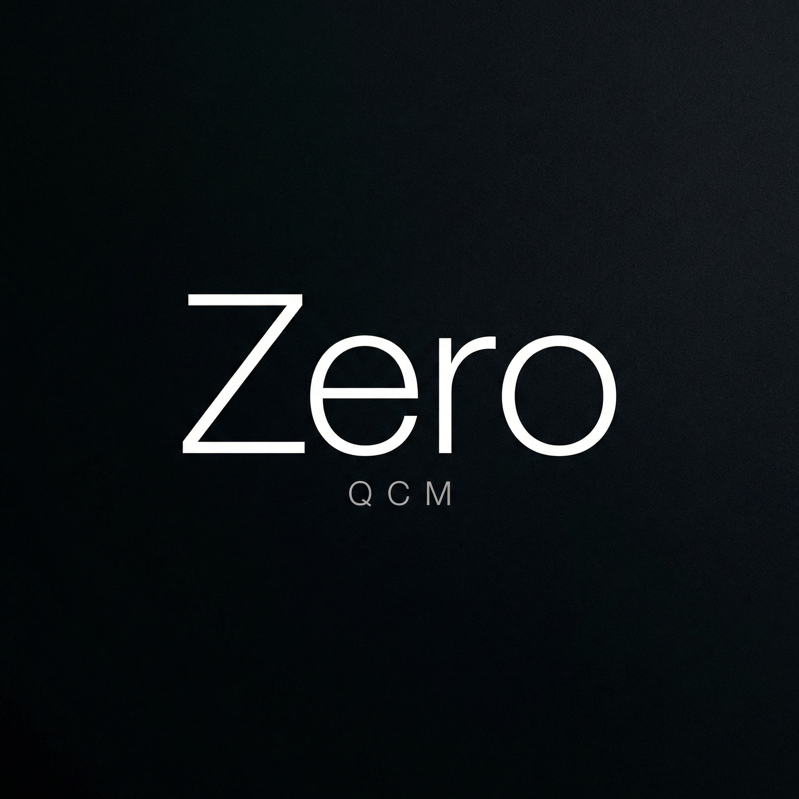
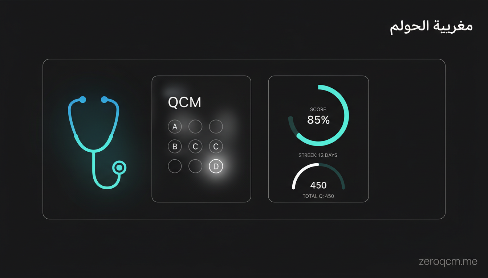

<div align="center">
  <br />
  
  <br /><br />

  <h1>ZeroQCM</h1>
  <p><strong>La révision médicale, réinventée.</strong></p>
  <p>
    Free, AI-powered QCM platform for Moroccan medical students —<br />
    S1 through S9, 180 000+ questions, built to replace MonQCM and DariQCM.
  </p>

  <br />

  [](https://zeroqcm.me)
  [](https://vercel.com)
  [](https://nextjs.org)
  [](https://typescriptlang.org)
  [](https://supabase.com)
  [](LICENSE)

  <br /><br />

  
</div>

---

## Table of Contents

- [Overview](#overview)
- [Features](#features)
- [Database](#database)
- [Tech Stack](#tech-stack)
- [Architecture](#architecture)
- [Getting Started](#getting-started)
- [Environment Variables](#environment-variables)
- [Project Structure](#project-structure)
- [AI Integration](#ai-integration)
- [Data Pipeline](#data-pipeline)
- [Deployment](#deployment)
- [Roadmap](#roadmap)

---

## Overview

ZeroQCM is a free, open-source medical revision platform built specifically for students at Moroccan medical faculties (FMPC, FMPR, FMPT, FMPK, FMPM and others). It aggregates 180 000+ validated QCM questions spanning all five years of the *premier cycle*, provides AI-powered per-option explanations via GitHub Models, and tracks each student's progress with a spaced-repetition algorithm — completely free, no account paywall.

> *"وَاللَّهُ أَخْرَجَكُم مِّن بُطُونِ أُمَّهَاتِكُمْ لَا تَعْلَمُونَ شَيْئاً وَجَعَلَ لَكُمُ السَّمْعَ وَالْأَبْصَارَ وَالْأَفْئِدَةَ ۙ لَعَلَّكُمْ تَشْكُرُونَ"*
> — An-Nahl 16:78

---

## Features

### 🎯 Core Quiz Engine

| Feature | Details |
|---|---|
| **QCM + QROC** | Multiple-choice and open-response questions supported |
| **Multi-select** | Handles questions with multiple correct answers |
| **Keyboard navigation** | `A–E` to select, `Enter` to confirm, `←/→` to navigate |
| **Swipe gestures** | Native touch swipe for mobile navigation |
| **Instant feedback** | Correct/incorrect revealed immediately with color-coded options |
| **Question counter** | Progress indicator across full module sessions |

### 🤖 AI Explanations

| Feature | Details |
|---|---|
| **Per-option AI explain** | Tap any option to get a tailored explanation for why it's right or wrong |
| **GitHub Models backend** | Server-side PAT — no API key required from the user |
| **Streaming responses** | Token-by-token streaming for instant perceived performance |
| **Shared cache** | Explanations stored in Supabase `ai_explanations` table, shared across all users |
| **Model picker** | Settings page dynamically lists available GitHub Models (GPT-4o, o3-mini, Llama 3.3 70B, Phi-4…) |
| **60s timeout** | `maxDuration = 60` on the API route prevents Vercel Hobby tier stream kills |

### 📊 Progress & Spaced Repetition

| Feature | Details |
|---|---|
| **Stats dashboard** | Animated SVG rings — total answered, success rate, streak |
| **Daily streak** | Consecutive revision days tracked |
| **Révision ciblée** | `/revision` — lists weak modules (failed 2+ times), launches focused sessions |
| **Per-module error badges** | Visual indicator of error count per module |
| **Reset stats** | One-tap reset with confirmation sheet — wipes all `user_answers` for the account |

### 🎨 Design System

| Feature | Details |
|---|---|
| **Dark / Light mode** | System-aware with manual toggle, persisted to `localStorage` |
| **CSS custom properties** | Full design token system — no hard-coded colors anywhere |
| **Framer Motion** | Staggered entrance animations, spring-based micro-interactions |
| **Apple-style aesthetics** | Hairline borders, negative space, monochrome palette |
| **Fully responsive** | Optimized for mobile, tablet, and desktop |
| **Scanline 404** | Medical EKG flatline 404 page — full EKG trace → flatline → defibrillator CTA |

### 🔐 Auth & Profiles

| Feature | Details |
|---|---|
| **Supabase Auth** | Email + password, no email verification required |
| **Auto-profile trigger** | PostgreSQL trigger creates `profiles` row on signup |
| **Year of study** | `annee_etude` (1–5) gates which semesters appear in the sidebar |
| **RLS policies** | Row-level security on all user data tables |

---

## Database

> 180 650+ questions · 5 faculties · all odd semesters S1–S9

| Semester | Year | Questions |
|---|---|---|
| S1 | Year 1 | 59 278 |
| S3 | Year 2 | 37 613 |
| S5 | Year 3 | 38 653 |
| S7 | Year 4 | 26 144 |
| S9 | Year 5 | 18 962 |
| **Total** | | **~180 650** |

### Schema

```sql
semesters       id, name, code
modules         id, semester_id, name, faculty
activities      id, module_id, title, type (qcm | open)
questions       id, activity_id, text, type, explanation
choices         id, question_id, text, is_correct
profiles        id (→ auth.users), full_name, annee_etude, preferences (jsonb)
user_answers    id, user_id, question_id, choice_id, is_correct, answered_at
ai_explanations id, prompt_hash, response, model, created_at
comments        id, question_id, user_id, content
comment_likes   id, comment_id, user_id
```

---

## Tech Stack

| Layer | Technology |
|---|---|
| **Framework** | [Next.js 15](https://nextjs.org) (App Router) |
| **Language** | TypeScript 5 |
| **Styling** | Tailwind CSS + CSS custom properties |
| **Animations** | [Framer Motion](https://www.framer.com/motion/) |
| **Database** | [Supabase](https://supabase.com) (PostgreSQL + RLS + Auth) |
| **AI** | [GitHub Models](https://github.com/marketplace/models) (server-side PAT, no user key) |
| **Deployment** | [Vercel](https://vercel.com) (Hobby, auto-deploy from `main`) |
| **Icons** | [Lucide React](https://lucide.dev) |
| **Font** | Inter (Google Fonts) · Scheherazade New (Arabic text) |

---

## Architecture

```
Browser
  └── Next.js App Router (SSR/CSR hybrid)
        ├── /app                    # Pages (App Router)
        │    ├── /                  # Landing + LoggedIn home
        │    ├── /semestres         # Semester/module browser
        │    ├── /quiz/[activityId] # Quiz engine
        │    ├── /revision          # Révision ciblée dashboard
        │    ├── /revision/[id]     # Focused quiz session
        │    ├── /stats             # Progress dashboard
        │    ├── /profil            # User profile
        │    ├── /settings          # AI model + theme + data reset
        │    ├── /auth              # Sign in / Sign up
        │    └── /not-found         # EKG flatline 404
        │
        ├── /api
        │    ├── /ai-explain        # GitHub Models streaming (maxDuration=60)
        │    ├── /gh-models         # Models catalog, cached 1h
        │    ├── /sync              # Cron 02:00 UTC — DariQCM incremental sync
        │    └── /scrape-expand     # POST {year} — seed new semester
        │
        └── /components
             ├── layout/            # AppShell, Sidebar, ThemeProvider
             ├── auth/              # AuthProvider, forms
             ├── quiz/              # QuizEngine, OptionCard, AIExplain
             └── ui/                # Shared primitives

Supabase (PostgreSQL)
  ├── Auth (email/password, no verification)
  ├── RLS policies (user_answers, profiles, ai_explanations)
  └── Trigger: create_profile_on_signup()
```

---

## Getting Started

### Prerequisites

- Node.js 20+
- [Bun](https://bun.sh) (recommended) or npm
- Supabase project
- GitHub PAT with `models:read` permission (for AI explanations)

### Installation

```bash
# Clone
git clone https://github.com/KNIGHTABDO/zeroqcm.git
cd zeroqcm

# Install dependencies
bun install

# Copy environment template
cp .env.example .env.local

# Fill in your env vars (see below), then:
bun dev
```

Open [http://localhost:3000](http://localhost:3000).

---

## Environment Variables

```env
# Supabase
NEXT_PUBLIC_SUPABASE_URL=https://your-project.supabase.co
NEXT_PUBLIC_SUPABASE_ANON_KEY=your-anon-key
SUPABASE_SERVICE_ROLE_KEY=your-service-role-key

# GitHub Models (server-side only — never exposed to client)
GITHUB_MODELS_TOKEN=ghp_your_token_with_models_read

# DariQCM sync (optional, for seeding)
DARIQCM_TOKEN=your-dariqcm-jwt
```

> **Security note:** `GITHUB_MODELS_TOKEN` is server-side only. Never prefix it with `NEXT_PUBLIC_`.
> Vercel Edge Runtime cannot access `sensitive`-type env vars — use Node.js runtime for the AI route.

---

## Project Structure

```
zeroqcm/
├── public/
│   ├── logo.jpg                  # ZeroQCM official logo
│   ├── favicon.ico               # 16/32/48px ICO
│   ├── icon.png                  # 512×512 PNG
│   ├── icon-192.png              # 192×192 PWA icon
│   ├── apple-touch-icon.png      # 180×180 iOS
│   ├── site.webmanifest          # PWA manifest
│   └── images/                   # Landing hero images
│
├── src/
│   ├── app/                      # Next.js App Router pages
│   ├── components/               # React components
│   ├── lib/
│   │   ├── supabase.ts           # Supabase client + helpers
│   │   └── utils.ts
│   └── types/                    # Shared TypeScript types
│
├── .env.example
├── next.config.ts
├── tailwind.config.ts
└── package.json
```

---

## AI Integration

ZeroQCM uses **GitHub Models** for AI explanations — entirely server-side, no API key required from students.

### How it works

1. Student taps an option → frontend sends `{ prompt, model }` to `/api/ai-explain`
2. API route authenticates with `GITHUB_MODELS_TOKEN` (server-side env var on Vercel)
3. Stream response chunked back to client, rendered token-by-token
4. On success, explanation stored in `ai_explanations` (keyed by `SHA256(prompt)`) — all future requests for the same question hit cache instantly

### Model whitelist

The API enforces a server-side model whitelist with `gpt-4o-mini` as fallback:

```ts
const ALLOWED_MODELS = [
  "gpt-4o-mini", "gpt-4o", "o3-mini", "o4-mini",
  "Meta-Llama-3.3-70B-Instruct", "Phi-4", "Phi-4-mini",
  "Mistral-Large-2", "Cohere-Command-R-Plus-08-2024",
];
```

Invalid model names (e.g., leftover `gemini-2.0-flash` from other integrations) silently return a 404 from GitHub Models — the whitelist prevents this.

---

## Data Pipeline

All question data is sourced from **DariQCM**, the official Moroccan medical faculty QCM platform.

### Sync architecture

```
DariQCM API (AES-256-GCM encrypted, key = SHA256(JWT))
  │
  ├── /api/scrape-expand?year=1-5   ← One-time seeding per semester
  │     └── Decrypts → normalizes → upserts to Supabase
  │
  └── /api/sync (Cron 02:00 UTC)    ← Incremental daily sync
        └── Fetches delta → upserts new questions
```

### Notes

- Only **odd semesters** (S1, S3, S5, S7, S9) exist on DariQCM — even semesters unpublished
- DariQCM gates content by `annee_etude` registration field — seeding covers all five years
- 2 176 open/QROC questions filtered from QCM quiz UI (displayed separately)

---

## Deployment

ZeroQCM is deployed on **Vercel** with automatic deploys from the `main` branch.

```
Push to main → Vercel build → Deploy to zeroqcm.me
```

### Critical Vercel settings

| Setting | Value | Why |
|---|---|---|
| Runtime for `/api/ai-explain` | `nodejs` (not `edge`) | Edge Runtime can't read sensitive env vars |
| `maxDuration` on AI route | `60` | Prevents default 10s Hobby timeout from killing streams |
| `GITHUB_MODELS_TOKEN` | Encrypted env var | Server-side only, never exposed to browser |

---

## Roadmap

- [ ] **MonQCM scraper** — add 10 years of past exam questions (2014–2024)
- [ ] **Bookmarks** — save specific questions for later review
- [ ] **Comments** — per-question student discussion (schema already in DB)
- [ ] **Leaderboard** — anonymous rank by streak and score
- [ ] **Offline mode** — PWA with service worker for exam-day use
- [ ] **Push notifications** — daily revision reminders
- [ ] **Faculty filter** — filter questions by source faculty
- [ ] **Export** — download weak questions as PDF

---

## Contributing

Pull requests are welcome. For major changes, open an issue first.

```bash
git checkout -b feature/your-feature
# make changes
git commit -m "feat: description"
git push origin feature/your-feature
```

---

## License

[MIT](LICENSE) — free to use, modify, and distribute.

---

<div align="center">
  <p>Built with ❤️ for Moroccan medical students</p>
  <p>
    <a href="https://zeroqcm.me">zeroqcm.me</a> ·
    <a href="https://github.com/KNIGHTABDO/zeroqcm">GitHub</a>
  </p>
</div>
